# Edu Management System

A production-ready school management backend built with **Go**, **Gin**, **GORM**, and **PostgreSQL**. It covers the full academic lifecycle — from user registration and class structure through enrollment, timetabling, exams, attendance, leave, fees, and notices.

---

## Table of contents

- [Tech stack](#tech-stack)
- [Project structure](#project-structure)
- [Architecture](#architecture)
- [Model relationships](#model-relationships)
- [Quick start (Docker)](#quick-start-docker)
- [Quick start (local)](#quick-start-local)
- [Environment variables](#environment-variables)
- [API reference](#api-reference)
  - [Auth](#auth)
  - [Register](#register)
  - [Users](#users)
  - [Students](#students)
  - [Teachers](#teachers)
  - [Departments](#departments)
  - [Standards](#standards)
  - [Class sections](#class-sections)
  - [Enrollment](#enrollment)
  - [Academic year](#academic-year)
  - [Subjects](#subjects)
  - [Timetable](#timetable)
  - [Exam](#exam)
  - [Attendance](#attendance)
  - [Leave](#leave)
  - [Notice](#notice)
- [Business rules](#business-rules)
- [Seeder accounts](#seeder-accounts)
- [Postman collection](#postman-collection)

---

## Tech stack

| Layer     | Choice                                                      |
| --------- | ----------------------------------------------------------- |
| Language  | Go 1.22+                                                    |
| Framework | [Gin](https://github.com/gin-gonic/gin)                     |
| ORM       | [GORM](https://gorm.io)                                     |
| Database  | PostgreSQL (latest)                                         |
| Auth      | JWT (access) + rotating refresh tokens                      |
| Decimals  | [shopspring/decimal](https://github.com/shopspring/decimal) |
| Logging   | [Zap](https://github.com/uber-go/zap)                       |
| Hashing   | bcrypt                                                      |
| Container | Docker + Docker Compose                                     |

---

## Project structure

```
.
├── cmd/
│   └── server/             ← main.go — entry point
├── constants/
│   └── api.go              ← ApiVersion = "/api/v1"
├── internal/
│   ├── app/                ← App struct (DB, Config, Logger)
│   ├── config/             ← Config struct loaded from env
│   ├── database/
│   │   └── models.go       ← All GORM models
│   ├── middleware/         ← AuthCheckMiddleware, ZapLogger, RecoveryWithResponse
│   ├── modules/
│   │   ├── auth/           ← Login, refresh, logout, change-password
│   │   ├── user/           ← Registration + user management
│   │   ├── student/        ← Student profile management
│   │   ├── teacher/        ← Teacher profile management
│   │   ├── department/     ← Department CRUD
│   │   ├── standard/       ← Standard CRUD + subject assignment
│   │   ├── classsection/   ← ClassSection CRUD
│   │   ├── enrollment/     ← StudentEnrollment + status transitions
│   │   ├── academicyear/   ← AcademicYear CRUD + activation
│   │   ├── subject/        ← Subject CRUD
│   │   ├── timetable/      ← TimeTable CRUD + conflict detection
│   │   ├── exam/           ← Exam + ExamSchedule + ExamResult
│   │   ├── attendance/     ← Student + Teacher attendance
│   │   ├── leave/          ← TeacherLeave approval workflow
│   │   └── notice/         ← Noticeboard with audience targeting
│   └── shared/
│       ├── pagination/     ← Params, NewFromRequest, Meta, NewMeta, Offset
│       ├── query_params/   ← Query[F], SortParams, NewSortFromRequest
│       └── response/       ← Success, Created, BadRequest, NotFound, …
├── pkg/
│   ├── hash/               ← Hash(plain), CheckHash(plain, hash)
│   └── jwt/                ← GenerateAccessToken, ParseAccessToken, GenerateRefreshToken
├── seeder/
│   ├── seeder.go           ← Run(db) — idempotent
│   └── user.seeder.go      ← SeedUsers(db)
├── Dockerfile
├── docker-compose.yml
└── .env.example
```

Every module follows an identical four-file layout:

```
module.domain.go      ← type aliases, requests, responses, filter params, mappers
module.repository.go  ← Repository interface + repositoryImpl
module.service.go     ← Service interface + service struct (all business rules)
module.handler.go     ← Handler struct, RegisterRouter, Routes, HTTP handlers
```

---

## Architecture



```
HTTP Request
     │
     ▼
┌─────────────┐
│  Gin Router  │  ← ZapLogger + RecoveryWithResponse middleware
└──────┬──────┘
       │
       ▼
┌─────────────┐
│  Middleware  │  ← AuthCheckMiddleware (JWT validation, sets user_id + role)
└──────┬──────┘
       │
       ▼
┌─────────────┐
│   Handler   │  ← Bind & validate request, call service, return response
└──────┬──────┘
       │
       ▼
┌─────────────┐
│   Service   │  ← Business rules, validation, orchestration
└──────┬──────┘
       │
       ▼
┌─────────────┐
│ Repository  │  ← GORM queries, data access only
└──────┬──────┘
       │
       ▼
┌─────────────┐
│  PostgreSQL │
└─────────────┘
```

**Key design decisions:**

- Auth middleware is applied **per route group**, not globally — each module decides which routes are protected.
- `User` creation is **atomic**: the profile record (student/teacher/parent/staff) is created first inside a `db.Begin()` transaction, then the `User` row with the profile FK. Rollback on any failure.
- **Refresh tokens are not JWTs** — they are random 256-bit hex strings stored in the database and rotate on every use.
- The active academic year is a **global UI context**, read from the `X-Academic-Year-ID` header (falling back to `?academic_year_id=` query param).
- **Sorting and filtering** use the generic `query_params.Query[F]` type — each module defines its own `FilterParams` and `allowedSortFields` to prevent SQL injection through untrusted sort fields.

---

## Model relationships

```
AcademicYear ──────────────────────────────────┐
     │                                         │
     ▼                                         ▼
ClassSection ◄── Standard ◄── Department   FeeStructure
     │               │
     │               └──► Subject (via StandardSubject join)
     │
     ├──► StudentEnrollment ◄── Student ◄── StudentParent ──► Parent
     │           │
     │           ├──► Attendance
     │           ├──► ExamResult ◄── ExamSchedule ◄── Exam ◄── AcademicYear
     │           └──► FeeRecord
     │
     ├──► TeacherAssignment ◄── Teacher
     ├──► TimeTable ◄── Teacher
     └──► Notice (optional scope)

Teacher ──► TeacherAttendance
        ──► TeacherLeave
        ──► Department (HeadTeacher)

User ──► Teacher | Student | Parent | Staff  (exactly one profile per role)
     ──► RolePermission
     ──► UserRefreshToken
```

The hierarchy for the academic structure flows strictly top-down:

```
Department → Standard → ClassSection (AcademicYear-scoped)
                 └───► StandardSubject (join) ───► Subject
```

---

## Quick start (Docker)

**Prerequisites:** Docker Desktop or Docker Engine + Docker Compose v2.

```bash
# 1. Clone the repository
git clone https://github.com/thalalhassan/edu_management.git
cd edu_management

# 2. Create your environment file
cp .env.example .env
# Edit .env — at minimum change JWT_SECRET

# 3. Build and start all services
docker compose up --build

# 4. The API is now available at:
#    http://localhost:8080/api/v1
```

To run in the background:

```bash
docker compose up --build -d
docker compose logs -f api   # tail logs
```

To stop and remove containers (data volume is preserved):

```bash
docker compose down
```

To also wipe the database volume:

```bash
docker compose down -v
```

---

## Quick start (local)

**Prerequisites:** Go 1.22+, PostgreSQL 15+.

```bash
# 1. Clone
git clone https://github.com/thalalhassan/edu_management.git
cd edu_management

# 2. Create a local .env
cp .env.example .env
# Set DB_HOST=localhost and fill in your local DB credentials

# 3. Install dependencies
go mod download

# 4. Run the server
go run ./cmd/server

# 5. The API is available at:
#    http://localhost:8080/api/v1
```

The server runs AutoMigrate on startup and then the idempotent seeder, so the database schema and seed accounts are created automatically on first run.

---

## Environment variables

| Variable          | Default          | Description                                  |
| ----------------- | ---------------- | -------------------------------------------- |
| `SERVER_PORT`     | `8080`           | Port the Gin server listens on               |
| `ENV`             | `development`    | `development` or `production`                |
| `DB_HOST`         | —                | PostgreSQL host (`postgres` inside Docker)   |
| `DB_PORT`         | `5432`           | PostgreSQL port                              |
| `DB_USER`         | `edu_user`       | Database user                                |
| `DB_PASSWORD`     | `edu_secret`     | Database password                            |
| `DB_NAME`         | `edu_management` | Database name                                |
| `DB_SSLMODE`      | `disable`        | `disable`, `require`, or `verify-full`       |
| `JWT_SECRET`      | —                | **Required.** Random secret for signing JWTs |
| `JWT_ACCESS_TTL`  | `15m`            | Access token lifetime (Go duration string)   |
| `JWT_REFRESH_TTL` | `168h`           | Refresh token lifetime (7 days)              |

Generate a secure `JWT_SECRET`:

```bash
openssl rand -hex 64
```

---

## API reference

Base URL: `http://localhost:8080/api/v1`

All protected endpoints require the header:

```
Authorization: Bearer <access_token>
```

---

### Auth

| Method | Path                       | Auth   | Description                                    |
| ------ | -------------------------- | ------ | ---------------------------------------------- |
| `POST` | `/auth/login`              | Public | Returns access + refresh tokens                |
| `POST` | `/auth/refresh`            | Public | Rotates refresh token, issues new access token |
| `POST` | `/auth/logout`             | Public | Revokes the provided refresh token             |
| `POST` | `/account/change-password` | ✓      | Invalidates all refresh tokens for the user    |

**Login request:**

```json
{
  "email": "admin@school.com",
  "password": "Password@123"
}
```

**Login response:**

```json
{
  "access_token": "<jwt>",
  "refresh_token": "<hex>",
  "expires_in": 900
}
```

---

### Register

All routes are protected. Profile + User are created atomically in a single transaction.

| Method | Path                | Description                            |
| ------ | ------------------- | -------------------------------------- |
| `POST` | `/register/student` | Creates Student profile + STUDENT User |
| `POST` | `/register/teacher` | Creates Teacher profile + TEACHER User |
| `POST` | `/register/parent`  | Creates Parent profile + PARENT User   |
| `POST` | `/register/staff`   | Creates Staff profile + STAFF User     |
| `POST` | `/register/admin`   | Creates ADMIN User (no profile)        |

---

### Users

| Method   | Path         | Description            |
| -------- | ------------ | ---------------------- |
| `GET`    | `/users/`    | List users (paginated) |
| `GET`    | `/users/:id` | Get user by ID         |
| `PUT`    | `/users/:id` | Update user            |
| `DELETE` | `/users/:id` | Soft-delete user       |

---

### Students

No `POST` — creation happens via `/register/student`.

| Method   | Path           | Description                           |
| -------- | -------------- | ------------------------------------- |
| `GET`    | `/student/`    | List students (paginated, filterable) |
| `GET`    | `/student/:id` | Get student by ID                     |
| `PUT`    | `/student/:id` | Update student profile                |
| `DELETE` | `/student/:id` | Soft-delete student                   |

---

### Teachers

| Method   | Path                             | Description            |
| -------- | -------------------------------- | ---------------------- |
| `GET`    | `/teacher/`                      | List teachers          |
| `GET`    | `/teacher/:id`                   | Get teacher by ID      |
| `GET`    | `/teacher/employee/:employee_id` | Lookup by employee ID  |
| `PUT`    | `/teacher/:id`                   | Update teacher profile |
| `PATCH`  | `/teacher/:id/active`            | Toggle active status   |
| `DELETE` | `/teacher/:id`                   | Soft-delete teacher    |

---

### Departments

Delete is blocked if the department has any standards.

| Method   | Path                   | Description                                  |
| -------- | ---------------------- | -------------------------------------------- |
| `POST`   | `/department/`         | Create department                            |
| `GET`    | `/department/`         | List all (no pagination — count stays small) |
| `GET`    | `/department/:id`      | Get department                               |
| `PUT`    | `/department/:id`      | Update department                            |
| `PATCH`  | `/department/:id/head` | Set or clear head teacher                    |
| `DELETE` | `/department/`         | Delete — blocked if standards exist          |

---

### Standards

Delete is blocked if the standard has class sections.

| Method   | Path                                  | Description                              |
| -------- | ------------------------------------- | ---------------------------------------- |
| `POST`   | `/standard/`                          | Create standard                          |
| `GET`    | `/standard/`                          | List all                                 |
| `GET`    | `/standard/:id`                       | Get standard                             |
| `GET`    | `/standard/department/:department_id` | Standards in a department                |
| `PUT`    | `/standard/:id`                       | Update standard                          |
| `DELETE` | `/standard/:id`                       | Delete — blocked if class sections exist |
| `GET`    | `/standard/:id/subjects`              | Subjects assigned to this standard       |
| `POST`   | `/standard/:id/subjects`              | Assign a subject                         |
| `DELETE` | `/standard/:id/subjects/:subject_id`  | Remove subject assignment                |

---

### Class sections

AY-scoped routes require `X-Academic-Year-ID` header.

| Method   | Path                                   | Description                                 |
| -------- | -------------------------------------- | ------------------------------------------- |
| `POST`   | `/class-section/`                      | Create class section                        |
| `GET`    | `/class-section/`                      | List (requires `X-Academic-Year-ID`)        |
| `GET`    | `/class-section/:id`                   | Get class section                           |
| `GET`    | `/class-section/standard/:standard_id` | Sections for a standard (AY-scoped)         |
| `GET`    | `/class-section/teacher/:teacher_id`   | Sections for a class teacher (AY-scoped)    |
| `PUT`    | `/class-section/:id`                   | Update class section                        |
| `PATCH`  | `/class-section/:id/teacher`           | Set or clear class teacher                  |
| `DELETE` | `/class-section/:id`                   | Delete — blocked if enrolled students exist |

---

### Enrollment

| Method   | Path                                         | Description                                                      |
| -------- | -------------------------------------------- | ---------------------------------------------------------------- |
| `POST`   | `/enrollment/`                               | Enroll a student in a class section                              |
| `GET`    | `/enrollment/:id`                            | Get enrollment                                                   |
| `GET`    | `/enrollment/student/:student_id`            | All enrollments for a student                                    |
| `GET`    | `/enrollment/class/:class_section_id/roster` | Full class roster                                                |
| `PATCH`  | `/enrollment/:id/status`                     | Transition status (ENROLLED → PROMOTED \| DETAINED \| WITHDRAWN) |
| `DELETE` | `/enrollment/:id`                            | Delete — blocked if attendance or exam records exist             |

---

### Academic year

`GET /` and `GET /active` are public — the UI calls these on load.

| Method   | Path                          | Auth   | Description                                      |
| -------- | ----------------------------- | ------ | ------------------------------------------------ |
| `GET`    | `/academic-year/`             | Public | List all academic years                          |
| `GET`    | `/academic-year/active`       | Public | Get the currently active year                    |
| `POST`   | `/academic-year/`             | ✓      | Create (always inactive)                         |
| `GET`    | `/academic-year/:id`          | ✓      | Get by ID                                        |
| `PUT`    | `/academic-year/:id`          | ✓      | Update                                           |
| `PATCH`  | `/academic-year/:id/activate` | ✓      | Switch active year (transaction-guarded)         |
| `DELETE` | `/academic-year/:id`          | ✓      | Delete — blocked if active or has class sections |

---

### Subjects

| Method   | Path           | Description                                                            |
| -------- | -------------- | ---------------------------------------------------------------------- |
| `POST`   | `/subject/`    | Create subject                                                         |
| `GET`    | `/subject/`    | List (filter: `search`, `is_elective`; sort: `name\|code\|created_at`) |
| `GET`    | `/subject/:id` | Get subject                                                            |
| `PUT`    | `/subject/:id` | Update subject                                                         |
| `DELETE` | `/subject/:id` | Delete — blocked if assigned to standards or timetables                |

---

### Timetable

Slot and teacher cross-class conflict detection is built into the service layer using half-open interval overlap: `start_a < end_b AND end_a > start_b`.

| Method   | Path                                          | Description                                                                  |
| -------- | --------------------------------------------- | ---------------------------------------------------------------------------- |
| `POST`   | `/timetable/`                                 | Create slot                                                                  |
| `GET`    | `/timetable/`                                 | List (filter: `class_section_id`, `teacher_id`, `subject_id`, `day_of_week`) |
| `GET`    | `/timetable/:id`                              | Get slot                                                                     |
| `GET`    | `/timetable/class/:class_section_id/schedule` | Full weekly view grouped by day                                              |
| `GET`    | `/timetable/teacher/:teacher_id/schedule`     | Teacher's weekly schedule                                                    |
| `PUT`    | `/timetable/:id`                              | Update slot                                                                  |
| `DELETE` | `/timetable/:id`                              | Delete slot                                                                  |

---

### Exam

| Method   | Path                                             | Description                                                    |
| -------- | ------------------------------------------------ | -------------------------------------------------------------- |
| `POST`   | `/exam/`                                         | Create exam (starts unpublished)                               |
| `GET`    | `/exam/`                                         | List (filter: `academic_year_id`, `exam_type`, `is_published`) |
| `GET`    | `/exam/:id`                                      | Get exam                                                       |
| `PUT`    | `/exam/:id`                                      | Update (title, type, dates)                                    |
| `PATCH`  | `/exam/:id/publish`                              | Publish or unpublish                                           |
| `DELETE` | `/exam/:id`                                      | Delete — blocked if published                                  |
| `POST`   | `/exam/:exam_id/schedule`                        | Add a schedule entry                                           |
| `GET`    | `/exam/:exam_id/schedule`                        | List schedules for an exam                                     |
| `GET`    | `/exam-schedule/:id`                             | Get schedule                                                   |
| `GET`    | `/exam-schedule/class-section/:class_section_id` | Schedules for a class section                                  |
| `PUT`    | `/exam-schedule/:id`                             | Update — blocked if results exist                              |
| `DELETE` | `/exam-schedule/:id`                             | Delete — blocked if results exist                              |
| `POST`   | `/exam-schedule/:schedule_id/result`             | Record single result                                           |
| `POST`   | `/exam-schedule/:schedule_id/result/bulk`        | Bulk record results                                            |
| `GET`    | `/exam-schedule/:schedule_id/result`             | Results for a schedule                                         |
| `GET`    | `/exam-result/:id`                               | Get result                                                     |
| `GET`    | `/exam-result/student/:student_enrollment_id`    | All results for a student                                      |
| `PUT`    | `/exam-result/:id`                               | Update result (recalculates PASS/FAIL)                         |
| `DELETE` | `/exam-result/:id`                               | Delete result                                                  |

---

### Attendance

#### Student attendance

| Method   | Path                                                          | Description                                                                                  |
| -------- | ------------------------------------------------------------- | -------------------------------------------------------------------------------------------- |
| `POST`   | `/attendance/`                                                | Mark single student attendance                                                               |
| `POST`   | `/attendance/bulk`                                            | Mark attendance for a whole class                                                            |
| `GET`    | `/attendance/`                                                | List (filter: `class_section_id`, `student_enrollment_id`, `date_from`, `date_to`, `status`) |
| `GET`    | `/attendance/:id`                                             | Get record                                                                                   |
| `GET`    | `/attendance/class/:class_section_id/summary?date=YYYY-MM-DD` | Daily summary with counts by status                                                          |
| `PUT`    | `/attendance/:id`                                             | Update status or remark                                                                      |
| `DELETE` | `/attendance/:id`                                             | Delete record                                                                                |

#### Teacher attendance

| Method   | Path                       | Description                                                   |
| -------- | -------------------------- | ------------------------------------------------------------- |
| `POST`   | `/teacher-attendance/`     | Mark single teacher attendance                                |
| `POST`   | `/teacher-attendance/bulk` | Mark attendance for multiple teachers                         |
| `GET`    | `/teacher-attendance/`     | List (filter: `teacher_id`, `date_from`, `date_to`, `status`) |
| `GET`    | `/teacher-attendance/:id`  | Get record                                                    |
| `PUT`    | `/teacher-attendance/:id`  | Update status or remark                                       |
| `DELETE` | `/teacher-attendance/:id`  | Delete record                                                 |

**Attendance status values:** `PRESENT` | `ABSENT` | `HALF_DAY` | `LATE` | `LEAVE`

---

### Leave

Approval workflow: teacher applies → admin/principal reviews → approved or rejected. A teacher can cancel their own pending request.

| Method   | Path                | Description                                                   |
| -------- | ------------------- | ------------------------------------------------------------- |
| `POST`   | `/leave/`           | Apply for leave                                               |
| `GET`    | `/leave/`           | List (filter: `teacher_id`, `status`, `date_from`, `date_to`) |
| `GET`    | `/leave/:id`        | Get leave request                                             |
| `PUT`    | `/leave/:id`        | Edit (PENDING only)                                           |
| `PATCH`  | `/leave/:id/review` | Approve or reject (reviewer ID from JWT)                      |
| `PATCH`  | `/leave/:id/cancel` | Teacher cancels their own pending request                     |
| `DELETE` | `/leave/:id`        | Delete (PENDING or REJECTED only)                             |

**Leave status values:** `PENDING` | `APPROVED` | `REJECTED`

The response includes a computed `duration_days` field (inclusive of both `from_date` and `to_date`).

---

### Notice

Draft-publish lifecycle: create draft → edit draft → publish → (optionally) unpublish → edit again → re-publish.

| Method   | Path                  | Description                                                             |
| -------- | --------------------- | ----------------------------------------------------------------------- |
| `POST`   | `/notice/`            | Create draft notice                                                     |
| `GET`    | `/notice/`            | List (filter: `audience`, `is_published`, `class_section_id`, `search`) |
| `GET`    | `/notice/:id`         | Get notice                                                              |
| `PUT`    | `/notice/:id`         | Update (DRAFT only)                                                     |
| `PATCH`  | `/notice/:id/publish` | Publish (`is_published: true`) or unpublish (`false`)                   |
| `DELETE` | `/notice/:id`         | Delete (unpublished only)                                               |

**Audience values:** `ALL` | `TEACHERS` | `STUDENTS` | `PARENTS` | `STAFF`

Querying with `?class_section_id=<uuid>` returns both section-scoped notices **and** school-wide notices (where `class_section_id IS NULL`) in one request — the intended pattern for the student/teacher dashboard view.

---

## Business rules

### Academic year

- New years are always created as inactive. Use `PATCH /:id/activate` to switch.
- Only one academic year can be active at a time — the activation is transaction-guarded (deactivates all, then activates the target).
- Cannot delete the active academic year.
- Cannot delete an academic year that has class sections.

### Class sections

- Section name must be unique within the same `standard + academic_year` combination.
- `MaxStrength` cannot be reduced below the current enrolled count.

### Enrollment

- A student cannot be enrolled in two class sections in the same academic year.
- Enrolling into a full class section (`MaxStrength` reached) is blocked.
- `PROMOTED` and `DETAINED` are terminal states — no further status changes.
- `WITHDRAWN` requires a `left_date`.
- Cannot delete an enrollment that has attendance or exam records.

### Timetable

- Class section slot conflict: no two timetable entries for the same section can overlap in time on the same day.
- Teacher cross-class conflict: a teacher cannot be assigned to two different sections at the same time.
- Conflict uses half-open interval: `start_a < end_b AND end_a > start_b`.

### Exam

- Cannot publish an exam with no schedules.
- Cannot delete a published exam (unpublish first).
- Exam schedule `exam_date` must fall within the exam's `start_date`–`end_date` window.
- `passing_marks` cannot exceed `max_marks`.
- Cannot update or delete a schedule that has results.
- `marks_obtained` cannot exceed `max_marks`. PASS/FAIL is computed automatically.

### Attendance

- One record per enrollment per day (duplicate check on create).
- Bulk mark will fail if any enrollment in the batch already has a record for that date.

### Leave

- `to_date` must be ≥ `from_date`.
- Overlapping non-rejected leave requests for the same teacher are blocked.
- Only PENDING leave requests can be edited or cancelled.
- The reviewer status must be `APPROVED` or `REJECTED` — passing `PENDING` is an error.
- Cannot delete an `APPROVED` leave request.

### Notice

- `expires_at` (if provided) must be a future timestamp.
- Published notices are read-only — unpublish before editing.
- Cannot publish a notice whose `expires_at` has already passed.
- Cannot delete a published notice.

### Auth

- Password change invalidates all refresh tokens for the user.
- Refresh tokens rotate on every use — the old token is revoked immediately.

---

## Seeder accounts

Run automatically on server startup. Password for all accounts: **`Password@123`**

| Email                      | Role        | Profile    |
| -------------------------- | ----------- | ---------- |
| `superadmin@school.com`    | SUPER_ADMIN | —          |
| `admin@school.com`         | ADMIN       | —          |
| `principal@school.com`     | PRINCIPAL   | —          |
| `rajesh.kumar@school.com`  | TEACHER     | EMP001     |
| `priya.nair@school.com`    | TEACHER     | EMP002     |
| `arjun.sharma@school.com`  | STUDENT     | ADM2024001 |
| `meera.pillai@school.com`  | STUDENT     | ADM2024002 |
| `suresh.sharma@school.com` | PARENT      | Father     |
| `latha.pillai@school.com`  | PARENT      | Mother     |
| `mohan.das@school.com`     | STAFF       | STF001     |

The seeder is idempotent — re-running it skips accounts that already exist.

---

## Postman collection

Postman collections are included for each module in the `postman/` directory:

| Collection                                               | Covers                                                                 |
| -------------------------------------------------------- | ---------------------------------------------------------------------- |
| `Edu_Management_Exam_Attendance.postman_collection.json` | Exam, ExamSchedule, ExamResult, Student Attendance, Teacher Attendance |
| `Edu_Management_Leave.postman_collection.json`           | Leave apply, review, cancel, delete                                    |
| `Edu_Management_Notice.postman_collection.json`          | Notice create, publish, update, delete                                 |

**Collection variables** (set these before running):

| Variable           | How to set                                           |
| ------------------ | ---------------------------------------------------- |
| `base_url`         | `http://localhost:8080`                              |
| `api_version`      | `/api/v1`                                            |
| `access_token`     | Auto-set by the Login request test script            |
| `refresh_token`    | Auto-set by the Login request test script            |
| `academic_year_id` | Auto-set by the Get Active Academic Year test script |

All other IDs (`exam_id`, `schedule_id`, `leave_id`, etc.) are auto-captured from the relevant `POST` response test scripts.
